<div align="center">

<!-- ═══════════════════════════  BANNER SVG  ═══════════════════════════ -->
<!--
  NOTE: The full animated game-scene banner lives in banner.svg.
  GitHub renders SVGs from  tags (not <object>/<embed>).
  Inline SVG below is the fallback; use the img tag below for the rich banner.
-->

<!-- ✅ Use this in your README for the animated banner: -->
<!--  -->

<svg width="860" height="180" viewBox="0 0 860 180" xmlns="http://www.w3.org/2000/svg">
  <defs>
    <linearGradient id="bg" x1="0%" y1="0%" x2="100%" y2="100%">
      <stop offset="0%"   stop-color="#0f0f23"/>
      <stop offset="50%"  stop-color="#1a1a3e"/>
      <stop offset="100%" stop-color="#0f1f0f"/>
    </linearGradient>
    <linearGradient id="titleGrad" x1="0%" y1="0%" x2="100%" y2="0%">
      <stop offset="0%"   stop-color="#4ade80"/>
      <stop offset="50%"  stop-color="#facc15"/>
      <stop offset="100%" stop-color="#f97316"/>
    </linearGradient>
    <filter id="glow">
      <feGaussianBlur stdDeviation="3" result="blur"/>
      <feMerge><feMergeNode in="blur"/><feMergeNode in="SourceGraphic"/></feMerge>
    </filter>
    <filter id="shadow">
      <feDropShadow dx="2" dy="2" stdDeviation="3" flood-color="#000" flood-opacity="0.6"/>
    </filter>
  </defs>

  <!-- Background -->
  <rect width="860" height="180" rx="18" fill="url(#bg)"/>

  <!-- Decorative grid lines (map tiles) -->
  <g opacity="0.08" stroke="#4ade80" stroke-width="0.5">
    <line x1="0" y1="30"  x2="860" y2="30"/>
    <line x1="0" y1="60"  x2="860" y2="60"/>
    <line x1="0" y1="90"  x2="860" y2="90"/>
    <line x1="0" y1="120" x2="860" y2="120"/>
    <line x1="0" y1="150" x2="860" y2="150"/>
    <line x1="50"  y1="0" x2="50"  y2="180"/>
    <line x1="100" y1="0" x2="100" y2="180"/>
    <line x1="150" y1="0" x2="150" y2="180"/>
    <line x1="760" y1="0" x2="760" y2="180"/>
    <line x1="810" y1="0" x2="810" y2="180"/>
  </g>

  <!-- Path tiles highlight -->
  <rect x="100" y="60"  width="29" height="29" rx="3" fill="#b45309" opacity="0.5"/>
  <rect x="130" y="60"  width="29" height="29" rx="3" fill="#b45309" opacity="0.5"/>
  <rect x="160" y="60"  width="29" height="29" rx="3" fill="#b45309" opacity="0.5"/>
  <rect x="160" y="90"  width="29" height="29" rx="3" fill="#b45309" opacity="0.5"/>
  <rect x="160" y="120" width="29" height="29" rx="3" fill="#b45309" opacity="0.5"/>

  <!-- Tower icons (left side) -->
  <!-- Cannon Tower -->
  <rect x="18" y="22" width="22" height="22" rx="3" fill="#c05038" filter="url(#shadow)"/>
  <rect x="29" y="30" width="14" height="4"  rx="1" fill="#222"/>
  <!-- Sniper Tower -->
  <rect x="18" y="52" width="18" height="22" rx="3" fill="#3cb4dc" filter="url(#shadow)"/>
  <rect x="36" y="60" width="18" height="3"  rx="1" fill="#050"/>
  <!-- MachineGun Tower -->
  <rect x="18" y="82" width="22" height="22" rx="3" fill="#a073b4" filter="url(#shadow)"/>
  <rect x="40" y="90" width="14" height="3"  rx="1" fill="#222"/>
  <!-- SlowTower -->
  <rect x="18" y="112" width="22" height="22" rx="3" fill="#3c64b4" filter="url(#shadow)"/>
  <!-- Buff Tower -->
  <rect x="18" y="142" width="22" height="22" rx="3" fill="#64c864" filter="url(#shadow)"/>

  <!-- Enemy icons (right side) -->
  <circle cx="820" cy="30"  r="10" fill="#dc3232" filter="url(#shadow)"/>
  <circle cx="820" cy="60"  r="8"  fill="#023232" filter="url(#shadow)"/>
  <circle cx="820" cy="90"  r="12" fill="#4e3c05" filter="url(#shadow)"/>
  <circle cx="820" cy="120" r="9"  fill="#19fa14" filter="url(#shadow)"/>
  <circle cx="820" cy="150" r="10" fill="#4646dc" filter="url(#shadow)"/>
  <!-- shield ring -->
  <circle cx="820" cy="150" r="14" fill="none" stroke="#6464ff" stroke-width="2" opacity="0.6"/>

  <!-- Bullets flying -->
  <circle cx="200" cy="75"  r="4" fill="#facc15" opacity="0.9"/>
  <circle cx="230" cy="70"  r="3" fill="#facc15" opacity="0.7"/>
  <circle cx="260" cy="65"  r="2" fill="#facc15" opacity="0.5"/>

  <!-- Main Title -->
  <text x="430" y="78" text-anchor="middle"
        font-family="'Segoe UI', Arial, sans-serif"
        font-size="52" font-weight="900" letter-spacing="2"
        fill="url(#titleGrad)" filter="url(#glow)">
    TOWER DEFENSE
  </text>

  <!-- Subtitle -->
  <text x="430" y="110" text-anchor="middle"
        font-family="'Segoe UI', Arial, sans-serif"
        font-size="17" fill="#94a3b8" letter-spacing="4">
    C++  ·  SFML  ·  OOP  ·  Polymorphism
  </text>

  <!-- Bottom tag line -->
  <text x="430" y="155" text-anchor="middle"
        font-family="'Segoe UI', Arial, sans-serif"
        font-size="13" fill="#4ade80" letter-spacing="1">
    ⚔️  Defend your base · Place towers · Survive 5 waves  ⚔️
  </text>

  <!-- Border glow -->
  <rect width="860" height="180" rx="18" fill="none"
        stroke="url(#titleGrad)" stroke-width="2" opacity="0.5"/>
</svg>

<!-- Badges -->
<br/>


</div>

---

## 📋 Table of Contents

- [🎮 Game Overview](#-game-overview)
- [✨ Features](#-features)
- [🏛️ OOP Architecture](#-oop-architecture)
- [👾 Enemy Types](#-enemy-types)
- [🗼 Tower Types](#-tower-types)
- [🗺️ Maps](#-maps)
- [💰 Economy & Waves](#-economy--waves)
- [📁 Project Structure](#-project-structure)
- [⚙️ Build & Run](#-build--run)
- [🎮 How to Play](#-how-to-play)
- [📸 Screenshots](#-screenshots)
- [🔧 Technologies Used](#-technologies-used)

---

## 🎮 Game Overview

**Tower Defense** is a fully playable, graphical C++ strategy game built with **SFML**. Waves of enemies march along a fixed path trying to reach your base. Place and upgrade defensive towers to destroy them before they escape. Survive all **5 waves** across **3 unique maps** to win!

> Built as an OOP course project demonstrating **inheritance**, **runtime polymorphism**, **encapsulation**, **operator overloading**, and **dynamic memory management** — all through a real, working application.

---

## ✨ Features

<!-- Feature grid SVG -->
<div align="center">
<svg width="760" height="240" viewBox="0 0 760 240" xmlns="http://www.w3.org/2000/svg">
  <defs>
    <linearGradient id="card1" x1="0%" y1="0%" x2="100%" y2="100%">
      <stop offset="0%" stop-color="#1e3a1e"/><stop offset="100%" stop-color="#14532d"/>
    </linearGradient>
    <linearGradient id="card2" x1="0%" y1="0%" x2="100%" y2="100%">
      <stop offset="0%" stop-color="#1e1b4b"/><stop offset="100%" stop-color="#312e81"/>
    </linearGradient>
    <linearGradient id="card3" x1="0%" y1="0%" x2="100%" y2="100%">
      <stop offset="0%" stop-color="#451a03"/><stop offset="100%" stop-color="#7c2d12"/>
    </linearGradient>
    <linearGradient id="card4" x1="0%" y1="0%" x2="100%" y2="100%">
      <stop offset="0%" stop-color="#0c4a6e"/><stop offset="100%" stop-color="#075985"/>
    </linearGradient>
    <linearGradient id="card5" x1="0%" y1="0%" x2="100%" y2="100%">
      <stop offset="0%" stop-color="#3b0764"/><stop offset="100%" stop-color="#6b21a8"/>
    </linearGradient>
    <linearGradient id="card6" x1="0%" y1="0%" x2="100%" y2="100%">
      <stop offset="0%" stop-color="#134e4a"/><stop offset="100%" stop-color="#115e59"/>
    </linearGradient>
  </defs>

  <!-- Row 1 -->
  <rect x="10"  y="10" width="220" height="100" rx="12" fill="url(#card1)" stroke="#4ade80" stroke-width="1"/>
  <text x="30"  y="42" font-family="Arial" font-size="22">🗺️</text>
  <text x="60"  y="42" font-family="Arial" font-size="14" font-weight="bold" fill="#4ade80">3 Unique Maps</text>
  <text x="30"  y="62" font-family="Arial" font-size="11" fill="#86efac">Classic Winding</text>
  <text x="30"  y="78" font-family="Arial" font-size="11" fill="#86efac">Long S-Curve</text>
  <text x="30"  y="94" font-family="Arial" font-size="11" fill="#86efac">Zigzag Rush</text>

  <rect x="270" y="10" width="220" height="100" rx="12" fill="url(#card2)" stroke="#818cf8" stroke-width="1"/>
  <text x="290" y="42" font-family="Arial" font-size="22">🏆</text>
  <text x="320" y="42" font-family="Arial" font-size="14" font-weight="bold" fill="#818cf8">Persistent Scores</text>
  <text x="290" y="62" font-family="Arial" font-size="11" fill="#a5b4fc">High score saved per map</text>
  <text x="290" y="78" font-family="Arial" font-size="11" fill="#a5b4fc">Displayed on menu</text>
  <text x="290" y="94" font-family="Arial" font-size="11" fill="#a5b4fc">File-based storage</text>

  <rect x="530" y="10" width="220" height="100" rx="12" fill="url(#card3)" stroke="#fb923c" stroke-width="1"/>
  <text x="550" y="42" font-family="Arial" font-size="22">🔊</text>
  <text x="580" y="42" font-family="Arial" font-size="14" font-weight="bold" fill="#fb923c">Sound Effects</text>
  <text x="550" y="62" font-family="Arial" font-size="11" fill="#fdba74">Cannon / Sniper / Machine Gun</text>
  <text x="550" y="78" font-family="Arial" font-size="11" fill="#fdba74">Enemy fire &amp; death sounds</text>
  <text x="550" y="94" font-family="Arial" font-size="11" fill="#fdba74">Win / Lose jingles</text>

  <!-- Row 2 -->
  <rect x="10"  y="130" width="220" height="100" rx="12" fill="url(#card4)" stroke="#38bdf8" stroke-width="1"/>
  <text x="30"  y="162" font-family="Arial" font-size="22">⬆️</text>
  <text x="60"  y="162" font-family="Arial" font-size="14" font-weight="bold" fill="#38bdf8">Tower Upgrades</text>
  <text x="30"  y="182" font-family="Arial" font-size="11" fill="#7dd3fc">3 upgrade levels each</text>
  <text x="30"  y="198" font-family="Arial" font-size="11" fill="#7dd3fc">Boosted damage &amp; range</text>
  <text x="30"  y="214" font-family="Arial" font-size="11" fill="#7dd3fc">In-game shop UI</text>

  <rect x="270" y="130" width="220" height="100" rx="12" fill="url(#card5)" stroke="#c084fc" stroke-width="1"/>
  <text x="290" y="162" font-family="Arial" font-size="22">🛡️</text>
  <text x="320" y="162" font-family="Arial" font-size="14" font-weight="bold" fill="#c084fc">Special Enemies</text>
  <text x="290" y="182" font-family="Arial" font-size="11" fill="#e9d5ff">Shielded: absorbs 3 hits</text>
  <text x="290" y="198" font-family="Arial" font-size="11" fill="#e9d5ff">Flying: ignores ground path</text>
  <text x="290" y="214" font-family="Arial" font-size="11" fill="#e9d5ff">Tank: extreme HP pool</text>

  <rect x="530" y="130" width="220" height="100" rx="12" fill="url(#card6)" stroke="#2dd4bf" stroke-width="1"/>
  <text x="550" y="162" font-family="Arial" font-size="22">⚔️</text>
  <text x="580" y="162" font-family="Arial" font-size="14" font-weight="bold" fill="#2dd4bf">Combat System</text>
  <text x="550" y="182" font-family="Arial" font-size="11" fill="#99f6e4">Enemies fire back at towers</text>
  <text x="550" y="198" font-family="Arial" font-size="11" fill="#99f6e4">Tower HP bars visible</text>
  <text x="550" y="214" font-family="Arial" font-size="11" fill="#99f6e4">Towers can be destroyed</text>
</svg>
</div>

---

## 🏛️ OOP Architecture

<div align="center">

<!-- Class Hierarchy SVG -->
<svg width="800" height="420" viewBox="0 0 800 420" xmlns="http://www.w3.org/2000/svg">
  <defs>
    <linearGradient id="entityGrad" x1="0%" y1="0%" x2="100%" y2="100%">
      <stop offset="0%" stop-color="#1e3a5f"/><stop offset="100%" stop-color="#2563eb"/>
    </linearGradient>
    <linearGradient id="enemyGrad"  x1="0%" y1="0%" x2="100%" y2="100%">
      <stop offset="0%" stop-color="#7f1d1d"/><stop offset="100%" stop-color="#dc2626"/>
    </linearGradient>
    <linearGradient id="towerGrad"  x1="0%" y1="0%" x2="100%" y2="100%">
      <stop offset="0%" stop-color="#14532d"/><stop offset="100%" stop-color="#16a34a"/>
    </linearGradient>
    <marker id="arrowBlue" markerWidth="8" markerHeight="6" refX="8" refY="3" orient="auto">
      <polygon points="0 0, 8 3, 0 6" fill="#60a5fa"/>
    </marker>
    <marker id="arrowRed"  markerWidth="8" markerHeight="6" refX="8" refY="3" orient="auto">
      <polygon points="0 0, 8 3, 0 6" fill="#f87171"/>
    </marker>
    <marker id="arrowGreen" markerWidth="8" markerHeight="6" refX="8" refY="3" orient="auto">
      <polygon points="0 0, 8 3, 0 6" fill="#4ade80"/>
    </marker>
  </defs>

  <rect width="800" height="420" rx="14" fill="#0f0f1a"/>

  <!-- Entity (root) -->
  <rect x="300" y="18" width="200" height="54" rx="10" fill="url(#entityGrad)" stroke="#60a5fa" stroke-width="2"/>
  <text x="400" y="42" text-anchor="middle" font-family="Arial" font-size="13" font-weight="bold" fill="#bfdbfe">Entity</text>
  <text x="400" y="60" text-anchor="middle" font-family="Arial" font-size="10" fill="#93c5fd">«abstract base»</text>

  <!-- Enemy (mid level) -->
  <rect x="80" y="130" width="190" height="54" rx="10" fill="url(#enemyGrad)" stroke="#f87171" stroke-width="2"/>
  <text x="175" y="154" text-anchor="middle" font-family="Arial" font-size="13" font-weight="bold" fill="#fecaca">Enemy</text>
  <text x="175" y="172" text-anchor="middle" font-family="Arial" font-size="10" fill="#fca5a5">«abstract»  move() render()</text>

  <!-- Tower (mid level) -->
  <rect x="530" y="130" width="190" height="54" rx="10" fill="url(#towerGrad)" stroke="#4ade80" stroke-width="2"/>
  <text x="625" y="154" text-anchor="middle" font-family="Arial" font-size="13" font-weight="bold" fill="#bbf7d0">Tower</text>
  <text x="625" y="172" text-anchor="middle" font-family="Arial" font-size="10" fill="#86efac">«abstract»  attack() render()</text>

  <!-- Arrows Entity → Enemy / Tower -->
  <line x1="360" y1="72" x2="230" y2="130" stroke="#60a5fa" stroke-width="2" marker-end="url(#arrowBlue)"/>
  <line x1="440" y1="72" x2="570" y2="130" stroke="#60a5fa" stroke-width="2" marker-end="url(#arrowBlue)"/>

  <!-- Enemy children -->
  <!-- BasicEnemy -->
  <rect x="10"  y="260" width="130" height="48" rx="8" fill="#450a0a" stroke="#f87171" stroke-width="1.5"/>
  <text x="75"  y="281" text-anchor="middle" font-family="Arial" font-size="11" font-weight="bold" fill="#fca5a5">BasicEnemy</text>
  <text x="75"  y="298" text-anchor="middle" font-family="Arial" font-size="9"  fill="#fecaca">HP:100  Spd:60</text>

  <!-- FastEnemy -->
  <rect x="155" y="260" width="130" height="48" rx="8" fill="#450a0a" stroke="#f87171" stroke-width="1.5"/>
  <text x="220" y="281" text-anchor="middle" font-family="Arial" font-size="11" font-weight="bold" fill="#fca5a5">FastEnemy</text>
  <text x="220" y="298" text-anchor="middle" font-family="Arial" font-size="9"  fill="#fecaca">HP:80   Spd:80</text>

  <!-- TankEnemy -->
  <rect x="10"  y="330" width="130" height="48" rx="8" fill="#450a0a" stroke="#f87171" stroke-width="1.5"/>
  <text x="75"  y="351" text-anchor="middle" font-family="Arial" font-size="11" font-weight="bold" fill="#fca5a5">TankEnemy</text>
  <text x="75"  y="368" text-anchor="middle" font-family="Arial" font-size="9"  fill="#fecaca">HP:300  Spd:35</text>

  <!-- FlyingEnemy -->
  <rect x="155" y="330" width="130" height="48" rx="8" fill="#450a0a" stroke="#f87171" stroke-width="1.5"/>
  <text x="220" y="351" text-anchor="middle" font-family="Arial" font-size="11" font-weight="bold" fill="#fca5a5">FlyingEnemy</text>
  <text x="220" y="368" text-anchor="middle" font-family="Arial" font-size="9"  fill="#fecaca">HP:160  Straight</text>

  <!-- ShieldedEnemy -->
  <rect x="82"  y="395" width="200" height="22" rx="6" fill="#3b0764" stroke="#c084fc" stroke-width="1.5"/>
  <text x="182" y="410" text-anchor="middle" font-family="Arial" font-size="10" font-weight="bold" fill="#e9d5ff">ShieldedEnemy  (custom)</text>

  <!-- Enemy arrows -->
  <line x1="140" y1="184" x2="75"  y2="260" stroke="#f87171" stroke-width="1.5" stroke-dasharray="4,3" marker-end="url(#arrowRed)"/>
  <line x1="175" y1="184" x2="220" y2="260" stroke="#f87171" stroke-width="1.5" stroke-dasharray="4,3" marker-end="url(#arrowRed)"/>
  <line x1="140" y1="184" x2="75"  y2="330" stroke="#f87171" stroke-width="1.5" stroke-dasharray="4,3" marker-end="url(#arrowRed)"/>
  <line x1="175" y1="184" x2="220" y2="330" stroke="#f87171" stroke-width="1.5" stroke-dasharray="4,3" marker-end="url(#arrowRed)"/>
  <line x1="150" y1="184" x2="182" y2="395" stroke="#c084fc" stroke-width="1.5" stroke-dasharray="4,3" marker-end="url(#arrowRed)"/>

  <!-- Tower children -->
  <!-- CannonTower -->
  <rect x="458" y="260" width="130" height="48" rx="8" fill="#052e16" stroke="#4ade80" stroke-width="1.5"/>
  <text x="523" y="281" text-anchor="middle" font-family="Arial" font-size="11" font-weight="bold" fill="#86efac">CannonTower</text>
  <text x="523" y="298" text-anchor="middle" font-family="Arial" font-size="9"  fill="#bbf7d0">Dmg:50  R:120</text>

  <!-- SniperTower -->
  <rect x="603" y="260" width="130" height="48" rx="8" fill="#052e16" stroke="#4ade80" stroke-width="1.5"/>
  <text x="668" y="281" text-anchor="middle" font-family="Arial" font-size="11" font-weight="bold" fill="#86efac">SniperTower</text>
  <text x="668" y="298" text-anchor="middle" font-family="Arial" font-size="9"  fill="#bbf7d0">Dmg:80  R:200</text>

  <!-- MachineGun -->
  <rect x="458" y="330" width="130" height="48" rx="8" fill="#052e16" stroke="#4ade80" stroke-width="1.5"/>
  <text x="523" y="351" text-anchor="middle" font-family="Arial" font-size="11" font-weight="bold" fill="#86efac">MachineGun</text>
  <text x="523" y="368" text-anchor="middle" font-family="Arial" font-size="9"  fill="#bbf7d0">Dmg:20  RoF:5</text>

  <!-- SlowTower -->
  <rect x="603" y="330" width="130" height="48" rx="8" fill="#052e16" stroke="#4ade80" stroke-width="1.5"/>
  <text x="668" y="351" text-anchor="middle" font-family="Arial" font-size="11" font-weight="bold" fill="#86efac">SlowTower</text>
  <text x="668" y="368" text-anchor="middle" font-family="Arial" font-size="9"  fill="#bbf7d0">Slows 45%  R:120</text>

  <!-- AbdTower (custom) -->
  <rect x="523" y="395" width="200" height="22" rx="6" fill="#14532d" stroke="#4ade80" stroke-width="1.5"/>
  <text x="623" y="410" text-anchor="middle" font-family="Arial" font-size="10" font-weight="bold" fill="#bbf7d0">AbdTower – Buff  (custom)</text>

  <!-- Tower arrows -->
  <line x1="590" y1="184" x2="523" y2="260" stroke="#4ade80" stroke-width="1.5" stroke-dasharray="4,3" marker-end="url(#arrowGreen)"/>
  <line x1="650" y1="184" x2="668" y2="260" stroke="#4ade80" stroke-width="1.5" stroke-dasharray="4,3" marker-end="url(#arrowGreen)"/>
  <line x1="590" y1="184" x2="523" y2="330" stroke="#4ade80" stroke-width="1.5" stroke-dasharray="4,3" marker-end="url(#arrowGreen)"/>
  <line x1="660" y1="184" x2="668" y2="330" stroke="#4ade80" stroke-width="1.5" stroke-dasharray="4,3" marker-end="url(#arrowGreen)"/>
  <line x1="620" y1="184" x2="623" y2="395" stroke="#4ade80" stroke-width="1.5" stroke-dasharray="4,3" marker-end="url(#arrowGreen)"/>

  <!-- Legend -->
  <line x1="310" y1="300" x2="360" y2="300" stroke="#60a5fa" stroke-width="2"/>
  <text x="365" y="304" font-family="Arial" font-size="10" fill="#93c5fd">Concrete inheritance</text>
  <line x1="310" y1="320" x2="360" y2="320" stroke="#60a5fa" stroke-width="2" stroke-dasharray="4,3"/>
  <text x="365" y="324" font-family="Arial" font-size="10" fill="#93c5fd">Abstract inheritance</text>
  <rect x="308" y="338" width="14" height="10" rx="2" fill="#3b0764" stroke="#c084fc" stroke-width="1"/>
  <text x="327" y="348" font-family="Arial" font-size="10" fill="#e9d5ff">Custom class</text>
</svg>

</div>

### Key OOP Principles Applied

| Principle | Implementation |
|-----------|---------------|
| **Abstraction** | `Entity` is a pure abstract base; `Enemy` and `Tower` are abstract intermediaries |
| **Inheritance** | All 5 enemy types and 5 tower types inherit through the hierarchy |
| **Polymorphism** | All enemies/towers stored as `Enemy**` / `Tower**` base pointers; virtual dispatch calls correct `move()`, `attack()`, `render()` |
| **Encapsulation** | Private/protected members throughout; public getters/setters only where needed |
| **Operator Overloading** | `operator==` on `Entity` compares by position |
| **Memory Management** | Manual `new`/`delete` with proper destructors; no leaks |

---

## 👾 Enemy Types

<div align="center">

<svg width="740" height="130" viewBox="0 0 740 130" xmlns="http://www.w3.org/2000/svg">
  <rect width="740" height="130" rx="10" fill="#0f0f1a"/>

  <!-- BasicEnemy -->
  <circle cx="70"  cy="55" r="18" fill="#dc2626"/>
  <text x="70"  y="95"  text-anchor="middle" font-family="Arial" font-size="11" font-weight="bold" fill="#fca5a5">Basic</text>
  <text x="70"  y="110" text-anchor="middle" font-family="Arial" font-size="9"  fill="#fecaca">HP 100 | Spd 60</text>

  <!-- FastEnemy -->
  <circle cx="215" cy="55" r="14" fill="#023232"/>
  <text x="215" y="95"  text-anchor="middle" font-family="Arial" font-size="11" font-weight="bold" fill="#5eead4">Fast</text>
  <text x="215" y="110" text-anchor="middle" font-family="Arial" font-size="9"  fill="#99f6e4">HP 80 | Spd 80</text>

  <!-- TankEnemy -->
  <circle cx="360" cy="55" r="22" fill="#4e3c05"/>
  <text x="360" y="95"  text-anchor="middle" font-family="Arial" font-size="11" font-weight="bold" fill="#fde68a">Tank</text>
  <text x="360" y="110" text-anchor="middle" font-family="Arial" font-size="9"  fill="#fef3c7">HP 300 | Spd 35</text>

  <!-- FlyingEnemy -->
  <circle cx="510" cy="55" r="16" fill="#19fa14"/>
  <!-- Wings suggestion -->
  <ellipse cx="490" cy="48" rx="10" ry="5" fill="#15803d" opacity="0.7"/>
  <ellipse cx="530" cy="48" rx="10" ry="5" fill="#15803d" opacity="0.7"/>
  <text x="510" y="95"  text-anchor="middle" font-family="Arial" font-size="11" font-weight="bold" fill="#bbf7d0">Flying</text>
  <text x="510" y="110" text-anchor="middle" font-family="Arial" font-size="9"  fill="#d1fae5">HP 160 | Straight line</text>

  <!-- ShieldedEnemy -->
  <circle cx="660" cy="55" r="18" fill="#4646dc"/>
  <circle cx="660" cy="55" r="24" fill="none" stroke="#6464ff" stroke-width="3" opacity="0.7"/>
  <text x="660" y="95"  text-anchor="middle" font-family="Arial" font-size="11" font-weight="bold" fill="#c4b5fd">Shielded ✦</text>
  <text x="660" y="110" text-anchor="middle" font-family="Arial" font-size="9"  fill="#ddd6fe">HP 120 | 3-hit shield</text>

  <!-- Labels top -->
  <text x="70"  y="22" text-anchor="middle" font-family="Arial" font-size="9" fill="#6b7280">Wave 1</text>
  <text x="215" y="22" text-anchor="middle" font-family="Arial" font-size="9" fill="#6b7280">Wave 2-3</text>
  <text x="360" y="22" text-anchor="middle" font-family="Arial" font-size="9" fill="#6b7280">Wave 4</text>
  <text x="510" y="22" text-anchor="middle" font-family="Arial" font-size="9" fill="#6b7280">Wave 3</text>
  <text x="660" y="22" text-anchor="middle" font-family="Arial" font-size="9" fill="#c084fc">Wave 5 ✦ Custom</text>
</svg>

</div>

| Enemy | HP | Speed | Reward | Special Ability |
|-------|-----|-------|--------|----------------|
| 🔴 **BasicEnemy** | 100 | 60 | 10g | Standard path follower |
| 🌊 **FastEnemy** | 80 | 80 | 15g | Hard to intercept; low HP |
| 🟤 **TankEnemy** | 300 | 35 | 20g | Extreme durability |
| 🟢 **FlyingEnemy** | 160 | 90 | 20g | Flies direct line, ignores path |
| 🟣 **ShieldedEnemy** *(custom)* | 120 | 50 | 25g | Absorbs first 3 hits before taking HP damage |

> All enemies **fire back** at towers within attack range and can **destroy** them.

---

## 🗼 Tower Types

<div align="center">

<svg width="740" height="130" viewBox="0 0 740 130" xmlns="http://www.w3.org/2000/svg">
  <rect width="740" height="130" rx="10" fill="#0f0f1a"/>

  <!-- CannonTower -->
  <rect x="46"  y="30" width="46" height="46" rx="6" fill="#c05038" stroke="#333" stroke-width="2"/>
  <rect x="92"  y="48" width="22" height="6"  rx="2" fill="#222"/>
  <text x="70"  y="95"  text-anchor="middle" font-family="Arial" font-size="11" font-weight="bold" fill="#fca5a5">Cannon</text>
  <text x="70"  y="110" text-anchor="middle" font-family="Arial" font-size="9"  fill="#fecaca">100g | Dmg 50</text>

  <!-- SniperTower -->
  <rect x="191" y="30" width="38" height="46" rx="6" fill="#3cb4dc" stroke="#333" stroke-width="2"/>
  <rect x="229" y="50" width="28" height="4"  rx="2" fill="#050"/>
  <text x="215" y="95"  text-anchor="middle" font-family="Arial" font-size="11" font-weight="bold" fill="#7dd3fc">Sniper</text>
  <text x="215" y="110" text-anchor="middle" font-family="Arial" font-size="9"  fill="#bae6fd">120g | R 200</text>

  <!-- MachineGun -->
  <rect x="336" y="30" width="46" height="46" rx="6" fill="#a073b4" stroke="#333" stroke-width="2"/>
  <rect x="382" y="47" width="22" height="5"  rx="2" fill="#222"/>
  <rect x="382" y="54" width="18" height="4"  rx="2" fill="#222"/>
  <text x="360" y="95"  text-anchor="middle" font-family="Arial" font-size="11" font-weight="bold" fill="#d8b4fe">MachineGun</text>
  <text x="360" y="110" text-anchor="middle" font-family="Arial" font-size="9"  fill="#e9d5ff">180g | RoF ×5</text>

  <!-- SlowTower -->
  <rect x="487" y="30" width="46" height="46" rx="6" fill="#3c64b4" stroke="#333" stroke-width="2"/>
  <circle cx="510" cy="53" r="20" fill="none" stroke="#60a5fa" stroke-width="2" opacity="0.5"/>
  <text x="510" y="95"  text-anchor="middle" font-family="Arial" font-size="11" font-weight="bold" fill="#93c5fd">Slow</text>
  <text x="510" y="110" text-anchor="middle" font-family="Arial" font-size="9"  fill="#bfdbfe">200g | 45% slow</text>

  <!-- AbdTower (Buff) -->
  <rect x="635" y="30" width="46" height="46" rx="6" fill="#64c864" stroke="#333" stroke-width="2"/>
  <circle cx="658" cy="53" r="22" fill="none" stroke="#4ade80" stroke-width="2" opacity="0.5"/>
  <text x="658" y="95"  text-anchor="middle" font-family="Arial" font-size="11" font-weight="bold" fill="#bbf7d0">Buff ✦</text>
  <text x="658" y="110" text-anchor="middle" font-family="Arial" font-size="9"  fill="#d1fae5">150g | +50% dmg</text>
</svg>

</div>

| Tower | Cost | Range | Damage | Fire Rate | Special |
|-------|------|-------|--------|-----------|---------|
| 🔴 **CannonTower** | 100g | 120 | 50 | 1.0/s | High single-shot damage |
| 🔵 **SniperTower** | 120g | 200 | 80 | 0.5/s | Longest range; precise |
| 🟣 **MachineGunTower** | 180g | 100 | 20 | 5.0/s | Rapid fire swarm killer |
| 🔷 **SlowTower** | 200g | 120 | — | AoE | Slows all enemies to 45% speed for 3s |
| 🟢 **AbdTower** *(custom)* | 150g | 90 | — | Aura | Boosts nearby tower damage by **+50%** |

> All towers are **upgradable up to Level 3**, increasing damage and range.

---

## 🗺️ Maps

<div align="center">

<svg width="720" height="190" viewBox="0 0 720 190" xmlns="http://www.w3.org/2000/svg">
  <defs>
    <linearGradient id="mapBg" x1="0%" y1="0%" x2="0%" y2="100%">
      <stop offset="0%" stop-color="#111827"/><stop offset="100%" stop-color="#1f2937"/>
    </linearGradient>
  </defs>
  <rect width="720" height="190" rx="12" fill="url(#mapBg)"/>

  <!-- Map 1: Classic Winding (20×12 mini grid 8px tiles) -->
  <text x="90" y="18" text-anchor="middle" font-family="Arial" font-size="12" font-weight="bold" fill="#4ade80">Map 1 – Classic Winding</text>
  <g transform="translate(10,24)">
    <!-- grass base -->
    <rect width="160" height="96" rx="4" fill="#2d4a2d"/>
    <!-- path tiles row 5 cols 0-5 -->
    <rect x="0"  y="40" width="8" height="8" fill="#b45309"/><rect x="8"  y="40" width="8" height="8" fill="#b45309"/>
    <rect x="16" y="40" width="8" height="8" fill="#b45309"/><rect x="24" y="40" width="8" height="8" fill="#b45309"/>
    <rect x="32" y="40" width="8" height="8" fill="#b45309"/><rect x="40" y="40" width="8" height="8" fill="#b45309"/>
    <!-- cols 5 going up rows 1-4 -->
    <rect x="40" y="8"  width="8" height="8" fill="#b45309"/><rect x="40" y="16" width="8" height="8" fill="#b45309"/>
    <rect x="40" y="24" width="8" height="8" fill="#b45309"/><rect x="40" y="32" width="8" height="8" fill="#b45309"/>
    <!-- row 1 cols 6-10 -->
    <rect x="48" y="8" width="8" height="8" fill="#b45309"/><rect x="56" y="8" width="8" height="8" fill="#b45309"/>
    <rect x="64" y="8" width="8" height="8" fill="#b45309"/><rect x="72" y="8" width="8" height="8" fill="#b45309"/>
    <rect x="80" y="8" width="8" height="8" fill="#b45309"/>
    <!-- col 10 going down rows 2-8 -->
    <rect x="80" y="16" width="8" height="8" fill="#b45309"/><rect x="80" y="24" width="8" height="8" fill="#b45309"/>
    <rect x="80" y="32" width="8" height="8" fill="#b45309"/><rect x="80" y="40" width="8" height="8" fill="#b45309"/>
    <rect x="80" y="48" width="8" height="8" fill="#b45309"/><rect x="80" y="56" width="8" height="8" fill="#b45309"/>
    <rect x="80" y="64" width="8" height="8" fill="#b45309"/>
    <!-- row 8 to exit -->
    <rect x="88"  y="64" width="8" height="8" fill="#b45309"/><rect x="96"  y="64" width="8" height="8" fill="#b45309"/>
    <rect x="104" y="64" width="8" height="8" fill="#b45309"/><rect x="112" y="64" width="8" height="8" fill="#b45309"/>
    <rect x="120" y="64" width="8" height="8" fill="#b45309"/><rect x="128" y="64" width="8" height="8" fill="#b45309"/>
    <rect x="136" y="64" width="8" height="8" fill="#b45309"/><rect x="144" y="64" width="8" height="8" fill="#b45309"/>
    <rect x="152" y="64" width="8" height="8" fill="#b45309"/>
    <!-- START / END labels -->
    <text x="0"   y="108" font-family="Arial" font-size="9" fill="#4ade80">▶ START</text>
    <text x="110" y="108" font-family="Arial" font-size="9" fill="#f87171">EXIT ▶</text>
  </g>

  <!-- Map 2: Long S-Curve -->
  <text x="370" y="18" text-anchor="middle" font-family="Arial" font-size="12" font-weight="bold" fill="#818cf8">Map 2 – Long S-Curve</text>
  <g transform="translate(290,24)">
    <rect width="160" height="96" rx="4" fill="#2d4a2d"/>
    <!-- top row right -->
    <rect x="0" y="0" width="48" height="8" fill="#b45309"/>
    <!-- col 5 down -->
    <rect x="40" y="0"  width="8" height="56" fill="#b45309"/>
    <!-- row 6 left -->
    <rect x="0" y="48" width="40" height="8" fill="#b45309"/>
    <!-- col 1 down -->
    <rect x="8" y="56" width="8" height="32" fill="#b45309"/>
    <!-- row 11 right -->
    <rect x="8"  y="80" width="88" height="8" fill="#b45309"/>
    <!-- col 10 up -->
    <rect x="80" y="24" width="8" height="56" fill="#b45309"/>
    <!-- row 3 right to exit -->
    <rect x="80" y="24" width="80" height="8" fill="#b45309"/>
    <text x="0"   y="108" font-family="Arial" font-size="9" fill="#4ade80">▶ START</text>
    <text x="110" y="32"  font-family="Arial" font-size="9" fill="#f87171">EXIT ▶</text>
  </g>

  <!-- Map 3: Zigzag Rush -->
  <text x="635" y="18" text-anchor="middle" font-family="Arial" font-size="12" font-weight="bold" fill="#fb923c">Map 3 – Zigzag Rush</text>
  <g transform="translate(555,24)">
    <rect width="160" height="96" rx="4" fill="#2d4a2d"/>
    <!-- enter bottom-left, up col 0 -->
    <rect x="0" y="24" width="8" height="72" fill="#b45309"/>
    <!-- row 8 right -->
    <rect x="0" y="24" width="64" height="8" fill="#b45309"/>
    <!-- col 8 up -->
    <rect x="56" y="0" width="8" height="24" fill="#b45309"/>
    <!-- row 2 right -->
    <rect x="56" y="0" width="40" height="8" fill="#b45309"/>
    <!-- col 12 down -->
    <rect x="88" y="0" width="8" height="64" fill="#b45309"/>
    <!-- row 9 right to exit -->
    <rect x="88" y="56" width="72" height="8" fill="#b45309"/>
    <text x="0"   y="108" font-family="Arial" font-size="9" fill="#4ade80">▶ START</text>
    <text x="100" y="64"  font-family="Arial" font-size="9" fill="#f87171">EXIT ▶</text>
  </g>
</svg>

</div>

---

## 💰 Economy & Waves

<div align="center">

<svg width="680" height="80" viewBox="0 0 680 80" xmlns="http://www.w3.org/2000/svg">
  <rect width="680" height="80" rx="10" fill="#0f0f1a"/>

  <!-- Wave bars -->
  <g font-family="Arial" font-size="11">
    <!-- Wave 1 -->
    <rect x="20"  y="20" width="100" height="40" rx="6" fill="#14532d" stroke="#4ade80" stroke-width="1"/>
    <text x="70"  y="38" text-anchor="middle" fill="#4ade80" font-weight="bold">Wave 1</text>
    <text x="70"  y="52" text-anchor="middle" fill="#86efac" font-size="9">BasicEnemy ×8</text>

    <rect x="136" y="20" width="100" height="40" rx="6" fill="#1e3a5f" stroke="#60a5fa" stroke-width="1"/>
    <text x="186" y="38" text-anchor="middle" fill="#60a5fa" font-weight="bold">Wave 2</text>
    <text x="186" y="52" text-anchor="middle" fill="#93c5fd" font-size="9">Basic + Fast ×11</text>

    <rect x="252" y="20" width="100" height="40" rx="6" fill="#3b0764" stroke="#c084fc" stroke-width="1"/>
    <text x="302" y="38" text-anchor="middle" fill="#c084fc" font-weight="bold">Wave 3</text>
    <text x="302" y="52" text-anchor="middle" fill="#ddd6fe" font-size="9">Fast + Flying ×14</text>

    <rect x="368" y="20" width="100" height="40" rx="6" fill="#451a03" stroke="#fb923c" stroke-width="1"/>
    <text x="418" y="38" text-anchor="middle" fill="#fb923c" font-weight="bold">Wave 4</text>
    <text x="418" y="52" text-anchor="middle" fill="#fdba74" font-size="9">TankEnemy ×17</text>

    <rect x="484" y="15" width="176" height="50" rx="6" fill="#7f1d1d" stroke="#f87171" stroke-width="2"/>
    <text x="572" y="37" text-anchor="middle" fill="#fca5a5" font-weight="bold" font-size="13">⚔ Wave 5  BOSS</text>
    <text x="572" y="54" text-anchor="middle" fill="#fecaca" font-size="9">Fast · Tank · Shielded ×20</text>
  </g>
</svg>

</div>

- 🟡 Start with **200 gold** and **10 lives**
- 💀 Lose **1 life** per enemy that escapes
- 💰 Earn gold for each enemy killed (10–25g depending on type)
- 📈 **Score** = `gold + lives × 50 + (wave − 1) × 100 + 500 (win bonus)`
- 🏆 High scores **saved to disk** per map and displayed on the selection screen

---

## 📁 Project Structure

```
Defence-Tower-Game/
│
├── Asset/
│   ├── Font/
│   │   ├── arial.TTF
│   │   ├── bebasneue.ttf
│   │   ├── opensans.ttf
│   │   └── roboto.ttf
│   │
│   └── Sound/               # 11 WAV audio files
│       ├── bgmusic.wav       # Background music
│       ├── bgmusic2.wav
│       ├── cannon.wav        # Cannon tower fire
│       ├── sniperfire.wav    # Sniper tower fire
│       ├── machine.wav       # Machine gun fire
│       ├── Enemyfiring.wav   # Enemy attacking tower
│       ├── enemyLeave.wav    # Enemy escapes base
│       ├── faaaa.wav         # Tower destroyed
│       ├── Towerplacing.wav  # Tower placed
│       ├── Won.wav           # Win jingle
│       └── lose.wav          # Lose jingle
│
├── Code/                     # 18 source files
│   ├── main.cpp              # Entry point
│   ├── Entity.h              # Abstract base: Entity
│   ├── Enemy.h               # Abstract: Enemy : Entity
│   ├── BasicEnemy.h
│   ├── FastEnemy.h
│   ├── TankEnemy.h
│   ├── FlyingEnemy.h
│   ├── ShieldedEnemy.h       # Custom enemy
│   ├── Tower.h               # Abstract: Tower : Entity
│   ├── CannonTower.h
│   ├── SniperTower.h
│   ├── MachineGunTower.h
│   ├── SlowTower.h
│   ├── AbdTower.h            # Custom tower (buff)
│   ├── Bullet.h
│   ├── GameMap.h
│   ├── Game.h
│   └── Game.cpp
│
├── Visuals/
│   ├── Pictures/             # Screenshots
│   └── Videos/               # Gameplay recordings
│
└── README.md
```

---

## ⚙️ Build & Run

### Prerequisites

| Requirement | Version |
|-------------|---------|
| C++ Compiler | C++17 or later |
| SFML | 2.5.x |
| IDE | Visual Studio 2019/2022 (recommended) |
| OS | Windows 10/11 |

### Visual Studio Setup

```
1. Clone/download the repository
2. Open Visual Studio → Create new Empty C++ Project
3. Add all .h and .cpp files from the Code/ folder to your project
4. Link SFML libraries:
   Project → Properties → Linker → Input → Additional Dependencies:
     sfml-graphics.lib
     sfml-window.lib
     sfml-system.lib
     sfml-audio.lib
5. Set Include Directories to your SFML include/ folder
6. Copy SFML .dll files to your project output directory
7. Update the font path in Game.cpp to match your system:
   font.loadFromFile("YOUR_PATH/arial.ttf");
8. Update sound paths in Game.cpp similarly
9. Build & Run (F5)
```

> **Note:** High scores are saved as `highscore_map1.txt`, `highscore_map2.txt`, `highscore_map3.txt` in the project working directory.

---

## 🎮 How to Play

<div align="center">

<svg width="680" height="160" viewBox="0 0 680 160" xmlns="http://www.w3.org/2000/svg">
  <rect width="680" height="160" rx="12" fill="#0f0f1a"/>

  <!-- Step arrows -->
  <defs>
    <marker id="stepArrow" markerWidth="8" markerHeight="6" refX="8" refY="3" orient="auto">
      <polygon points="0 0, 8 3, 0 6" fill="#facc15"/>
    </marker>
  </defs>

  <!-- Steps -->
  <!-- 1 -->
  <rect x="10"  y="30" width="120" height="90" rx="10" fill="#1e293b" stroke="#facc15" stroke-width="1.5"/>
  <text x="70"  y="58" text-anchor="middle" font-family="Arial" font-size="22">🗺️</text>
  <text x="70"  y="80" text-anchor="middle" font-family="Arial" font-size="11" font-weight="bold" fill="#facc15">Select Map</text>
  <text x="70"  y="96" text-anchor="middle" font-family="Arial" font-size="9" fill="#94a3b8">Choose one of</text>
  <text x="70"  y="110" text-anchor="middle" font-family="Arial" font-size="9" fill="#94a3b8">3 maps</text>

  <line x1="130" y1="75" x2="150" y2="75" stroke="#facc15" stroke-width="2" marker-end="url(#stepArrow)"/>

  <!-- 2 -->
  <rect x="152" y="30" width="120" height="90" rx="10" fill="#1e293b" stroke="#4ade80" stroke-width="1.5"/>
  <text x="212" y="58" text-anchor="middle" font-family="Arial" font-size="22">🖱️</text>
  <text x="212" y="80" text-anchor="middle" font-family="Arial" font-size="11" font-weight="bold" fill="#4ade80">Place Tower</text>
  <text x="212" y="96" text-anchor="middle" font-family="Arial" font-size="9" fill="#94a3b8">Left-click green</text>
  <text x="212" y="110" text-anchor="middle" font-family="Arial" font-size="9" fill="#94a3b8">grass tile</text>

  <line x1="272" y1="75" x2="292" y2="75" stroke="#facc15" stroke-width="2" marker-end="url(#stepArrow)"/>

  <!-- 3 -->
  <rect x="294" y="30" width="120" height="90" rx="10" fill="#1e293b" stroke="#f87171" stroke-width="1.5"/>
  <text x="354" y="58" text-anchor="middle" font-family="Arial" font-size="22">⚔️</text>
  <text x="354" y="80" text-anchor="middle" font-family="Arial" font-size="11" font-weight="bold" fill="#f87171">Defend Waves</text>
  <text x="354" y="96" text-anchor="middle" font-family="Arial" font-size="9" fill="#94a3b8">Towers auto-fire</text>
  <text x="354" y="110" text-anchor="middle" font-family="Arial" font-size="9" fill="#94a3b8">earn gold on kill</text>

  <line x1="414" y1="75" x2="434" y2="75" stroke="#facc15" stroke-width="2" marker-end="url(#stepArrow)"/>

  <!-- 4 -->
  <rect x="436" y="30" width="120" height="90" rx="10" fill="#1e293b" stroke="#c084fc" stroke-width="1.5"/>
  <text x="496" y="58" text-anchor="middle" font-family="Arial" font-size="22">⬆️</text>
  <text x="496" y="80" text-anchor="middle" font-family="Arial" font-size="11" font-weight="bold" fill="#c084fc">Upgrade</text>
  <text x="496" y="96" text-anchor="middle" font-family="Arial" font-size="9" fill="#94a3b8">Click tower to</text>
  <text x="496" y="110" text-anchor="middle" font-family="Arial" font-size="9" fill="#94a3b8">upgrade / inspect</text>

  <line x1="556" y1="75" x2="576" y2="75" stroke="#facc15" stroke-width="2" marker-end="url(#stepArrow)"/>

  <!-- 5 -->
  <rect x="578" y="30" width="92" height="90" rx="10" fill="#1e293b" stroke="#facc15" stroke-width="1.5"/>
  <text x="624" y="58" text-anchor="middle" font-family="Arial" font-size="22">🏆</text>
  <text x="624" y="80" text-anchor="middle" font-family="Arial" font-size="11" font-weight="bold" fill="#facc15">Win!</text>
  <text x="624" y="96" text-anchor="middle" font-family="Arial" font-size="9" fill="#94a3b8">Survive all 5</text>
  <text x="624" y="110" text-anchor="middle" font-family="Arial" font-size="9" fill="#94a3b8">waves</text>
</svg>

</div>

### Controls

| Action | Input |
|--------|-------|
| **Place Tower** | Left-click on a green (grass) tile |
| **Select Tower to Upgrade** | Left-click on an existing tower |
| **Cancel / Deselect** | Right-click |
| **Return to Map Select** | `R` key  *(after win/game-over)* |
| **Return to Map Select** | Click anywhere on end screen |

---

## 📸 Screenshots

<div align="center">

| Map Selection | Gameplay – Wave 4 |
|:---:|:---:|
| .png) |  |

| Flying Enemy in Action | Game Over Screen |
|:---:|:---:|
|  |  |

| Enemy Escapes | Tower Destroyed | You Win! |
|:---:|:---:|:---:|
|  |  |  |

</div>

---

## 🔧 Technologies Used

<div align="center">


</div>

| Library / Tool | Purpose |
|----------------|---------|
| **SFML Graphics** | Window creation, shape rendering, sprites, fonts |
| **SFML Audio** | Sound buffers, sound playback, background music streaming |
| **C++ STL** | `<cmath>`, `<fstream>`, `<cstdio>` |
| **Visual Studio** | IDE, debugger, linker configuration |
| **GitHub** | Version control and source hosting |

---

## 👨‍💻 About the Author

<div align="center">

<svg width="720" height="170" viewBox="0 0 720 170" xmlns="http://www.w3.org/2000/svg">
  <defs>
    <linearGradient id="aboutBg" x1="0%" y1="0%" x2="100%" y2="100%">
      <stop offset="0%" stop-color="#030712"/><stop offset="100%" stop-color="#0f172a"/>
    </linearGradient>
    <linearGradient id="aboutLine" x1="0%" y1="0%" x2="100%" y2="0%">
      <stop offset="0%"   stop-color="#4ade80" stop-opacity="0"/>
      <stop offset="30%"  stop-color="#4ade80"/>
      <stop offset="70%"  stop-color="#f97316"/>
      <stop offset="100%" stop-color="#f97316" stop-opacity="0"/>
    </linearGradient>
  </defs>
  <rect width="720" height="170" rx="14" fill="url(#aboutBg)" stroke="#1e293b" stroke-width="1.5"/>
  <!-- Terminal dots -->
  <circle cx="20" cy="18" r="5" fill="#ef4444" opacity="0.8"/>
  <circle cx="34" cy="18" r="5" fill="#facc15" opacity="0.8"/>
  <circle cx="48" cy="18" r="5" fill="#4ade80" opacity="0.8"/>
  <text x="62" y="22" font-family="'Courier New', monospace" font-size="9" fill="#374151">about-author.txt</text>
  <line x1="10" y1="30" x2="710" y2="30" stroke="#1e293b" stroke-width="1"/>
  <!-- Avatar placeholder -->
  <circle cx="55" cy="90" r="32" fill="#1e293b" stroke="#4ade80" stroke-width="2"/>
  <text x="55" y="98" text-anchor="middle" font-family="Arial" font-size="28">🧑‍💻</text>
  <!-- Name / title -->
  <text x="105" y="58" font-family="'Segoe UI', Arial" font-size="18" font-weight="bold" fill="#f8fafc">Abdullah Tahir</text>
  <text x="105" y="76" font-family="'Courier New', monospace" font-size="11" fill="#4ade80">BS Data Science · FAST NUCES Lahore  (2025–2029)</text>
  <!-- Description -->
  <foreignObject x="105" y="84" width="600" height="60">
    <body xmlns="http://www.w3.org/1999/xhtml">
      <p style="font-family:Arial;font-size:11px;color:#94a3b8;margin:0;line-height:1.5">
        Building complex systems from scratch — chess engines with Minimax AI, memory-managed simulators, 
        full-stack web platforms, and this Tower Defense game. 
        Certified in AI, Data Analytics, Cybersecurity &amp; Entrepreneurship.
      </p>
    </body>
  </foreignObject>
  <!-- Social link badges -->
  <!-- GitHub -->
  <rect x="105" y="145" width="110" height="18" rx="4" fill="#24292e"/>
  <text x="115" y="158" font-family="'Courier New', monospace" font-size="10" fill="#fff">⬡ ABD-ABDULLAH83</text>
  <!-- LinkedIn -->
  <rect x="222" y="145" width="148" height="18" rx="4" fill="#0a66c2"/>
  <text x="232" y="158" font-family="'Courier New', monospace" font-size="10" fill="#fff">in ABDULLAH-TAHIR-DS</text>
  <!-- Portfolio -->
  <rect x="377" y="145" width="170" height="18" rx="4" fill="#4ade80"/>
  <text x="387" y="158" font-family="'Courier New', monospace" font-size="10" fill="#052e16">🌐 ABD-ABDULLAH83.GITHUB.IO</text>
  <!-- Fiverr -->
  <rect x="554" y="145" width="120" height="18" rx="4" fill="#1dbf73"/>
  <text x="564" y="158" font-family="'Courier New', monospace" font-size="10" fill="#fff">fiverr ABDULLAHT_143</text>
  <!-- Bottom line -->
  <line x1="10" y1="166" x2="710" y2="166" stroke="url(#aboutLine)" stroke-width="1"/>
</svg>

</div>

| 🔗 Link | Details |
|--------|---------|
| **GitHub** | [Abd-Abdullah83](https://github.com/Abd-Abdullah83) |
| **Portfolio** | [abd-abdullah83.github.io](https://abd-abdullah83.github.io) |
| **LinkedIn** | [abdullah-tahir-ds](https://linkedin.com/in/abdullah-tahir-ds) |
| **Fiverr** | [abdullaht_143](https://fiverr.com/abdullaht_143) |

---

<div align="center">

<!-- Footer SVG -->
<svg width="680" height="60" viewBox="0 0 680 60" xmlns="http://www.w3.org/2000/svg">
  <defs>
    <linearGradient id="footerGrad" x1="0%" y1="0%" x2="100%" y2="0%">
      <stop offset="0%"   stop-color="#4ade80" stop-opacity="0"/>
      <stop offset="30%"  stop-color="#4ade80"/>
      <stop offset="70%"  stop-color="#facc15"/>
      <stop offset="100%" stop-color="#facc15" stop-opacity="0"/>
    </linearGradient>
  </defs>
  <rect width="680" height="60" rx="10" fill="#0f0f1a"/>
  <line x1="40" y1="30" x2="640" y2="30" stroke="url(#footerGrad)" stroke-width="1.5"/>
  <text x="340" y="26" text-anchor="middle" font-family="Arial" font-size="13" font-weight="bold" fill="#facc15">
    ⚔️  Defend · Upgrade · Survive  ⚔️
  </text>
  <text x="340" y="46" text-anchor="middle" font-family="Arial" font-size="10" fill="#64748b">
    Built with C++ · SFML · OOP Principles  |  github.com/Abd-Abdullah83/Defence-Tower-Game-
  </text>
</svg>

<br/>

*Made with ❤️ in Pakistan 🇵🇰 · © 2026 Abdullah Tahir*

⭐ **If you found this project useful, drop a star!**

</div>
