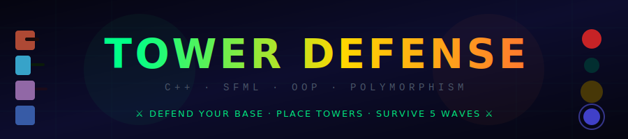
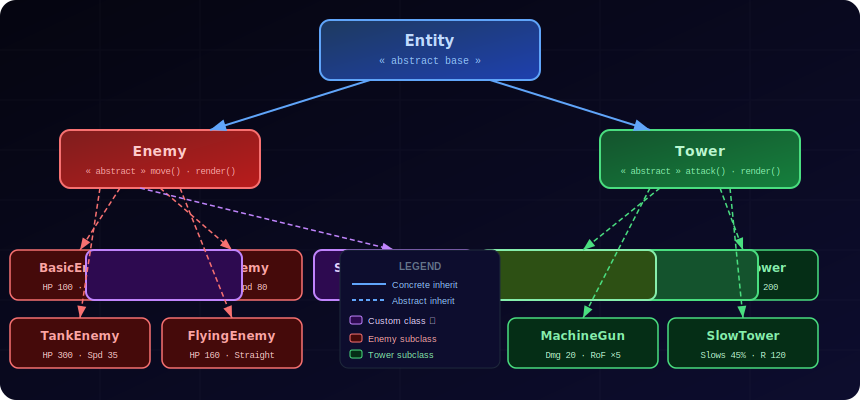
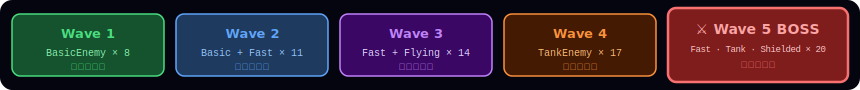
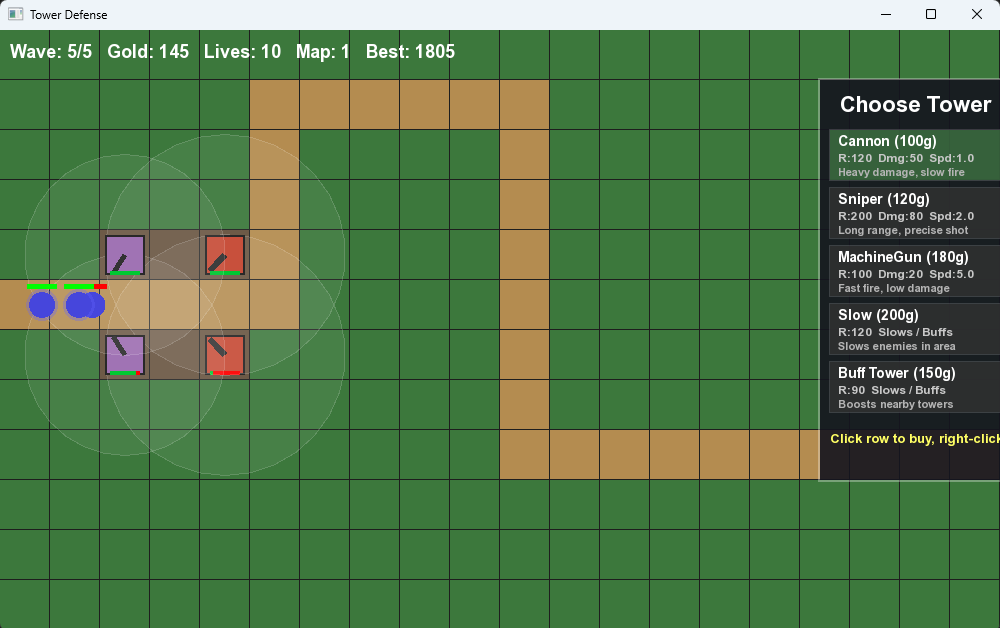
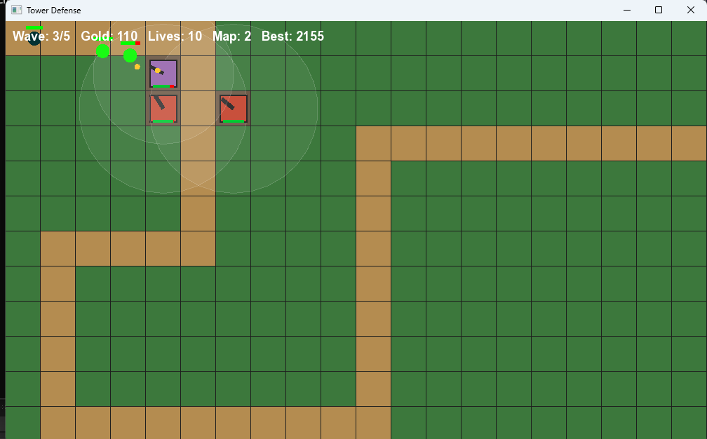
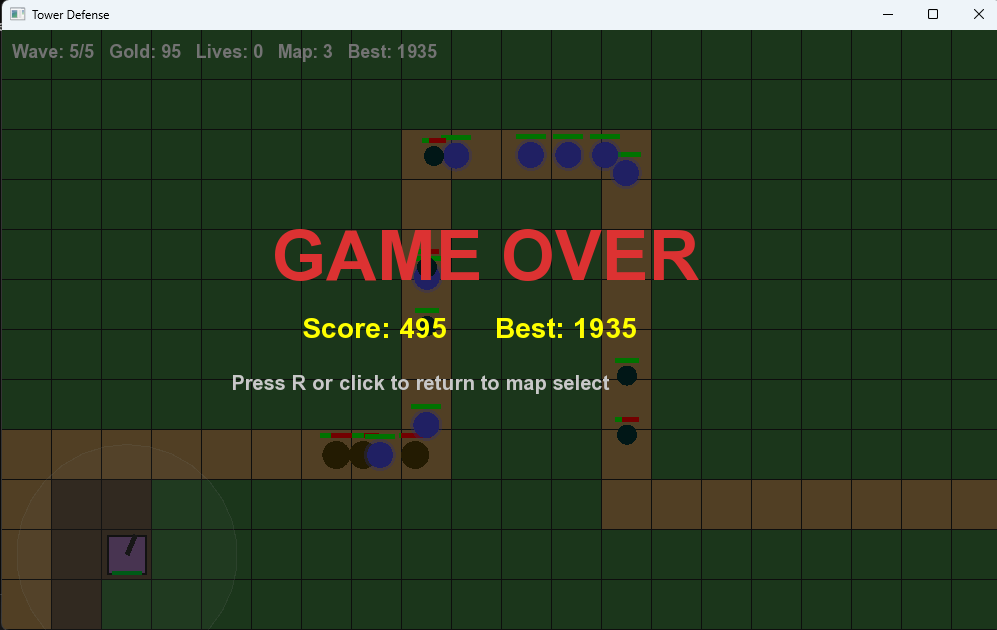
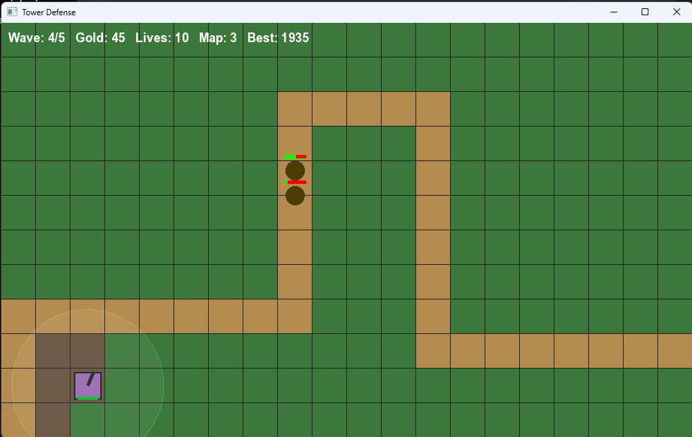
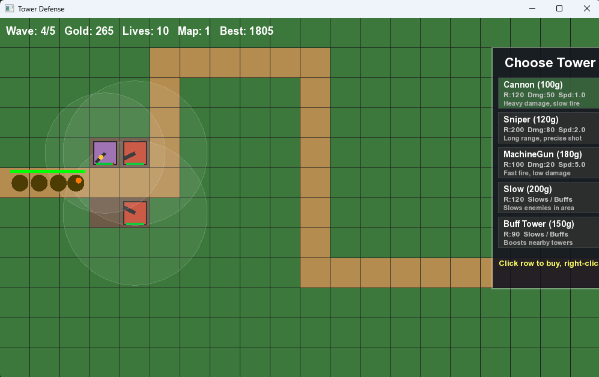
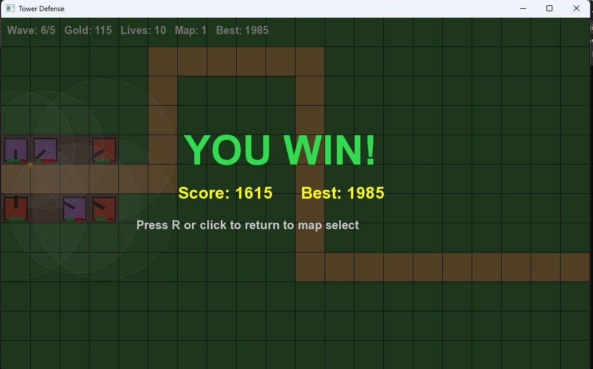

<div align="center">



<br/>

<!-- Badges -->
[](https://en.cppreference.com/w/cpp/17)
[](https://www.sfml-dev.org/)
[](https://visualstudio.microsoft.com/)
[](#-oop-architecture)
[](#)

</div>

---

## 📋 Table of Contents

| | Section |
|---|---------|
| 🎮 | [Game Overview](#-game-overview) |
| ✨ | [Features](#-features) |
| 🏛️ | [OOP Architecture](#%EF%B8%8F-oop-architecture) |
| 👾 | [Enemy Types](#-enemy-types) |
| 🗼 | [Tower Types](#-tower-types) |
| 🗺️ | [Maps](#%EF%B8%8F-maps) |
| 💰 | [Economy & Waves](#-economy--waves) |
| 📁 | [Project Structure](#-project-structure) |
| ⚙️ | [Build & Run](#%EF%B8%8F-build--run) |
| 🎮 | [How to Play](#-how-to-play) |
| 📸 | [Screenshots](#-screenshots) |

---

## 🎮 Game Overview

> **Tower Defense** is a fully playable, graphical C++ strategy game built with **SFML**.
> Waves of enemies march along a fixed path — place and upgrade towers to destroy them before they escape.
> Survive all **5 waves** across **3 unique maps** to win.

Built as an OOP course project demonstrating **inheritance**, **runtime polymorphism**, **encapsulation**, **operator overloading**, and **dynamic memory management** — all inside a real, working game.

---

## ✨ Features

| Feature | Details |
|---------|---------|
| 🗺️ **3 Unique Maps** | Classic Winding · Long S-Curve · Zigzag Rush |
| 🏆 **Persistent High Scores** | Saved per map, displayed on selection screen |
| 🔊 **Sound Effects** | Cannon · Sniper · Machine Gun · Win/Lose jingles |
| ⬆️ **Tower Upgrades** | 3 upgrade levels — boosted damage & range |
| 🛡️ **Special Enemies** | Shielded · Flying · Tank with unique mechanics |
| ⚔️ **Combat System** | Enemies fire back at towers — towers can be destroyed! |

---

## 🏛️ OOP Architecture

<!-- ═══════════════════════════════════════════
     OOP DIAGRAM  →  paste your oop-diagram.svg here
     (file: svg/oop-diagram.svg)
═══════════════════════════════════════════ -->
<div align="center">

</div>

<br/>

### Key OOP Principles

| Principle | How It's Applied |
|-----------|-----------------|
| **Abstraction** | `Entity` is a pure abstract base; `Enemy` and `Tower` are abstract intermediaries |
| **Inheritance** | All 5 enemy types and 5 tower types inherit through the full hierarchy |
| **Polymorphism** | Stored as `Enemy**` / `Tower**` base pointers; virtual dispatch calls correct `move()`, `attack()`, `render()` |
| **Encapsulation** | Private/protected members throughout; public getters/setters only where needed |
| **Operator Overloading** | `operator==` on `Entity` compares by position |
| **Memory Management** | Manual `new`/`delete` with proper destructors; no memory leaks |

---

## 👾 Enemy Types

| Enemy | HP | Speed | Reward | Special |
|-------|:--:|:-----:|:------:|---------|
| 🔴 **BasicEnemy** | 100 | 60 | 10g | Standard path follower |
| 🌊 **FastEnemy** | 80 | 80 | 15g | Hard to intercept; low HP |
| 🟤 **TankEnemy** | 300 | 35 | 20g | Extreme durability |
| 🟢 **FlyingEnemy** | 160 | 90 | 20g | Flies in a straight line — ignores the path entirely |
| 🟣 **ShieldedEnemy** ✦ *custom* | 120 | 50 | 25g | Absorbs first **3 hits** before taking any HP damage |

> ⚠️ All enemies **fire back** at towers within range and can **destroy** them.

---

## 🗼 Tower Types

| Tower | Cost | Range | Damage | Fire Rate | Special |
|-------|:----:|:-----:|:------:|:---------:|---------|
| 🔴 **CannonTower** | 100g | 120 | 50 | 1.0/s | High single-shot damage |
| 🔵 **SniperTower** | 120g | 200 | 80 | 0.5/s | Longest range; precision targeting |
| 🟣 **MachineGunTower** | 180g | 100 | 20 | 5.0/s | Rapid-fire swarm killer |
| 🔷 **SlowTower** | 200g | 120 | — | AoE | Slows all enemies to **45% speed** for 3s |
| 🟢 **AbdTower** ✦ *custom* | 150g | 90 | — | Aura | Boosts nearby tower damage by **+50%** |

> All towers are **upgradable to Level 3**, increasing damage and range each level.

---

## 🗺️ Maps

| Map | Path Style | Difficulty | Description |
|-----|-----------|:----------:|-------------|
| **Map 1** — Classic Winding | Winding S-path | ⭐⭐ | A gradual curve giving you time to set up defenses |
| **Map 2** — Long S-Curve | Extended S | ⭐⭐⭐ | Longer path with fewer natural chokepoints |
| **Map 3** — Zigzag Rush | Tight zigzag | ⭐⭐⭐⭐ | Rapid direction changes — towers must cover multiple angles |

---

## 💰 Economy & Waves

<!-- ═══════════════════════════════════════════
     WAVE BAR  →  paste your waves.svg here
     (file: svg/waves.svg)
═══════════════════════════════════════════ -->
<div align="center">

</div>

<br/>

- 🟡 **Start** with **200 gold** and **10 lives**
- 💀 **Lose 1 life** for each enemy that escapes your base
- 💰 **Earn gold** per enemy killed — 10g to 25g depending on type
- 📈 **Score formula:** `gold + lives × 50 + (wave − 1) × 100 + 500 (win bonus)`
- 🏆 High scores **saved per map** to disk and shown on the map selection screen

---

## 📁 Project Structure

```
Defence-Tower-Game/
│
├── Asset/
│   ├── Font/                     # arial.TTF  bebasneue.ttf  opensans.ttf  roboto.ttf
│   └── Sound/                    # 11 WAV audio files
│       ├── bgmusic.wav            # Background music
│       ├── cannon.wav             # Cannon tower fire
│       ├── sniperfire.wav         # Sniper tower fire
│       ├── machine.wav            # Machine gun fire
│       ├── Enemyfiring.wav        # Enemy attacking tower
│       ├── enemyLeave.wav         # Enemy escapes base
│       ├── faaaa.wav              # Tower destroyed
│       ├── Towerplacing.wav       # Tower placed
│       ├── Won.wav / lose.wav     # Win & lose jingles
│
├── Code/                          # 18 source files
│   ├── main.cpp                   # Entry point
│   ├── Entity.h                   # Abstract base — Entity
│   ├── Enemy.h                    # Abstract — Enemy : Entity
│   ├── BasicEnemy.h / FastEnemy.h / TankEnemy.h / FlyingEnemy.h
│   ├── ShieldedEnemy.h            # ✦ Custom enemy
│   ├── Tower.h                    # Abstract — Tower : Entity
│   ├── CannonTower.h / SniperTower.h / MachineGunTower.h / SlowTower.h
│   ├── AbdTower.h                 # ✦ Custom buff tower
│   ├── Bullet.h / GameMap.h
│   └── Game.h / Game.cpp
│
├── Visuals/
│   ├── Pictures/                  # Screenshots
│   └── Videos/                    # Gameplay recordings
│
└── README.md
```

---

## ⚙️ Build & Run

### Prerequisites

| Requirement | Version |
|-------------|---------|
| C++ Compiler | C++17 or later |
| SFML | 2.5.x |
| IDE | Visual Studio 2019 / 2022 (recommended) |
| OS | Windows 10 / 11 |

### Visual Studio Setup

```bash
# 1. Clone the repository
git clone https://github.com/Abd-Abdullah83/Defence-Tower-Game-.git

# 2. Open Visual Studio → New Empty C++ Project
# 3. Add all .h and .cpp files from Code/ to your project

# 4. Linker → Input → Additional Dependencies:
sfml-graphics.lib
sfml-window.lib
sfml-system.lib
sfml-audio.lib

# 5. Set Include Directories to your SFML include/ folder
# 6. Copy SFML .dll files to your project output directory

# 7. Update paths in Game.cpp:
font.loadFromFile("YOUR_PATH/arial.ttf");
# (update sound paths similarly)

# 8. Build & Run → F5
```

> **Note:** High scores are saved as `highscore_map1.txt`, `highscore_map2.txt`, `highscore_map3.txt` in the working directory.

---

## 🎮 How to Play

| Step | Action | Details |
|------|--------|---------|
| 1️⃣ | **Select Map** | Choose from 3 maps on the menu screen |
| 2️⃣ | **Buy a Tower** | Pick a tower type from the shop panel |
| 3️⃣ | **Place Tower** | Left-click any green (grass) tile |
| 4️⃣ | **Survive Waves** | Towers auto-fire; earn gold on each kill |
| 5️⃣ | **Upgrade** | Click an existing tower → upgrade for more power |
| 6️⃣ | **Win!** | Survive all 5 waves without running out of lives |

### Controls

| Action | Input |
|--------|-------|
| Place Tower | `Left-click` on a grass tile |
| Select / Upgrade Tower | `Left-click` an existing tower |
| Cancel / Deselect | `Right-click` |
| Return to Map Select | `R` key *(after win or game-over)* |

---

## 📸 Screenshots

<div align="center">

<!-- Replace these paths with your actual screenshot files -->

| Map Selection | Wave 4 Gameplay |
|:---:|:---:|
| .png) |  |

| Flying Enemy | Game Over |
|:---:|:---:|
|  |  |

| Enemy Escapes | Tower Destroyed | Victory! |
|:---:|:---:|:---:|
|  |  |  |

</div>

---

## 🔧 Technologies Used

| Tool / Library | Purpose |
|----------------|---------|
| **C++17** | Core language — OOP, memory management, STL |
| **SFML Graphics** | Window creation, shape rendering, sprites, fonts |
| **SFML Audio** | Sound buffers, playback, background music streaming |
| **Visual Studio 2022** | IDE, debugger, linker configuration |
| **GitHub** | Version control and source hosting |

---

## 👨‍💻 About the Author

<div align="center">

**Abdullah Tahir**
*BS Data Science · FAST NUCES Lahore (2025–2029)*

Building complex systems from scratch — chess engines with Minimax AI, memory-managed simulators,
full-stack web platforms, and this Tower Defense game.
Certified in AI, Data Analytics, Cybersecurity & Entrepreneurship.

<br/>

[](https://github.com/Abd-Abdullah83)
[](https://abd-abdullah83.github.io)
[](https://linkedin.com/in/abdullah-tahir-ds)
[](https://fiverr.com/abdullaht_143)
[](mailto:abdullaht4000@gmail.com)

</div>

---

<div align="center">

**⚔️  Defend · Upgrade · Survive  ⚔️**

*Built with C++ · SFML · OOP Principles*

[github.com/Abd-Abdullah83/Defence-Tower-Game-](https://github.com/Abd-Abdullah83/Defence-Tower-Game-)

*Made with ❤️ in Pakistan 🇵🇰 · © 2026 Abdullah Tahir*

⭐ **If you found this project useful, please drop a star!**

</div>
